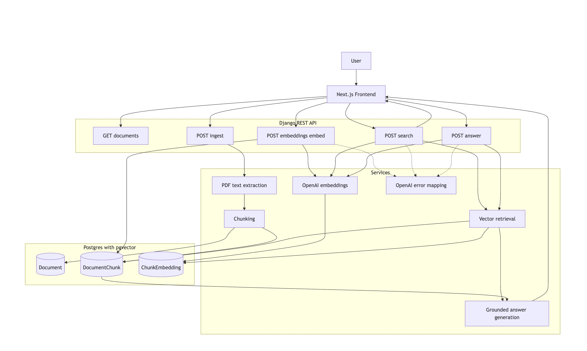

# lexicon-ai

Production-shaped MVP for a “knowledge copilot” (RAG) built with:
- Django + Django REST Framework
- PostgreSQL + pgvector
- OpenAI embeddings + grounded chat
- Next.js (React + TypeScript)

## Architecture

### Document scoping (important)

Search and Answer accept `document_id` (single) or `document_ids` (multi) to restrict retrieval to the selected documents.

## Quick start (local)

### Backend

1. Install dependencies:
   - `cd backend`
   - `python3 -m venv .venv && source .venv/bin/activate`
   - `pip install -r requirements.txt`

2. Configure environment:
   - `cp .env.example .env`

3. Start Postgres + pgvector:
   - `docker compose -f docker-compose.yml up -d`

4. Apply migrations + start the server:
   - `python src/manage.py migrate`
   - `python src/manage.py runserver 8000`

Notes:
- CORS for the frontend is handled by `CORS_ALLOWED_ORIGINS` (defaults to `http://localhost:3000`).
- Uploaded PDF source files are stored under `backend/src/media/`.

### Frontend

1. Install dependencies:
   - `cd frontend`
   - `npm install`

2. Configure environment:
   - `cp .env.local.example .env.local`

3. Run:
   - `npm run dev`

## How to use the UI

1. `Ingest PDF` (upload a PDF)
2. `Embed` (generates embeddings for the new chunks)
3. `Search` (semantic search via pgvector)
4. `Answer (RAG)` (LLM answer grounded in retrieved chunks, with citations)

